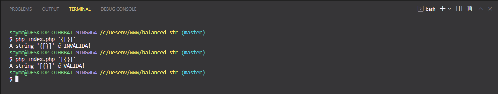

# balanced-str

Classe responsável por fazer o balanceamento dos caracteres

### Índices

- [Overview](#overview)
- [Construído com](#construído-com)
- [Como usar](#como-usar)

### Overview


### Construído com
- [PHP 8.2+](https://www.php.net/)

### Como usar
Para clonar e executar este aplicativo, você precisará do Git e do PHP >= 8.2 instalados em seu computador. Na sua linha de comando:
```bash
# Clona o repositório
$ git clone https://github.com/saymontavares/balanced-str.git
```
```bash
# Excuta o teste
$ php index.php '[{}]'
# A string '[{}]' é VÁLIDA!

$ php index.php '{[}]'
# A string '{[}]' é INVÁLIDA!
```